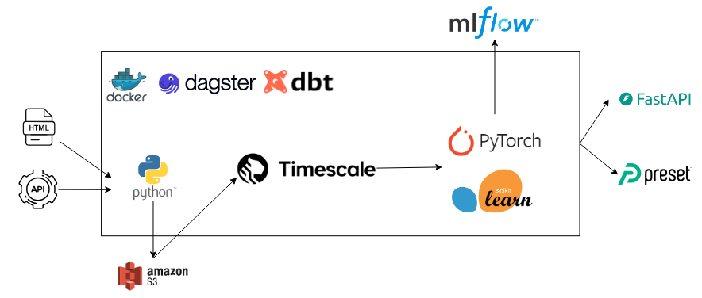

# Open Source Project for Analysis and Prediction of Dengue Cases

This is an open source project focused on the aggregation and analysis of data on dengue fever. The initiative gathers information from various sources, such as public health records and environmental data, with the aim of facilitating the study of the number of cases of the disease and the understanding of the factors that influence its spread.

In a second phase, the focus will be on the application of machine learning techniques to predict the occurrence of dengue fever cases, using historical data and variables such as climate and socioeconomic conditions.

## Objectives

- **Data Aggregation**: Integration of data from various sources, such as [Public Health Data](https://www.saude.sp.gov.br/cve-centro-de-vigilancia-epidemiologica-prof.-alexandre-vranjac/areas-de-vigilancia/doencas-de-transmissao-por-vetores-e-zoonoses/arboviroses-urbanas/dengue-dados-estatisticos) and [Air Quality Data](https://www.iqair.com/commercial-air-quality-monitors/api?srsltid=AfmBOopvgbuOJajDktfrBKCwsINs1zqF6wdzWM5m7O1x2x8qmH6PkBDI).
  
- **Data Analysis**: Analysis of aggregated data, performing statistical analyses and presenting historical series through dashboards.

- **Case Prediction**: Implementation of machine learning models to predict dengue fever outbreaks.

## Code Architecture

Data extraction is orchestrated via Dagster in a Docker container, which uploads the obtained data to S3 Storage. In a second step, the data is loaded into the TimescaleDB database, where, through DBT, transformations are performed through the bronze, silver and gold layers, in order to process the data for analysis and training of machine learning models.

